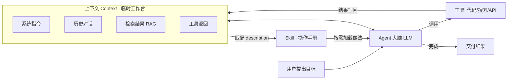

# 概念关系 · Agent × 上下文 × Skill

> 学习日期：2026-09-06 · 由 concept-learner 思路整理（AI 草稿）
> 单篇概念详解（交互 HTML 版）见 `learning-materials/agent.html`、`learning-materials/llm-context.html`、`learning-materials/skill.html`。
> 本文件为 Markdown 源（GitHub 可直接渲染 Mermaid）；另有 `learning-materials/concept-relationship.html` 交互版。

## 一句话关系
**Agent 是会"动手做事"的系统，Context 是它每次思考时那张大小有限的"临时工作台"，Skill 是它放在手边、按需翻阅的"专业操作手册"。** 三者组合起来，才构成"通用模型 → 能稳定完成专业任务"的完整闭环。

## 角色定位对比

| 维度 | Agent | Context（上下文） | Skill |
|---|---|---|---|
| 是什么 | 自主完成任务的人工智能系统 | 模型单次调用能看到的全部输入 | 某类任务"怎么做"的说明书文件夹 |
| 回答的问题 | 谁来干、怎么推进 | 现在能"看见"什么 | 这件事的专业做法是什么 |
| 生命周期 | 随任务持续存在 | **每轮调用即生成、即消耗** | 常驻文件，按需加载 |
| 记忆属性 | 使用 Context 作短期记忆 | 短期"工作台"，会话结束即清 | 长期沉淀的"外部经验" |
| 类比 | 员工本人 | 桌面 + 手头文件 | SOP 手册/工具包 |

## 三者的协作全景

## 重点一：上下文如何影响 Agent 的工作

1. **决定"记性"好坏**：Agent 没有真正的记忆，能"想起来"的只有被放回上下文的内容。窗口=短期记忆的上限，超出的历史会被截断或遗忘。
2. **决定"判断依据"**：工具返回、检索片段、系统指令都先汇入上下文，模型才据此决定下一步。**给错信息 = 做错决策**（例如把过期价格放进上下文，Agent 就会按过期价报价）。
3. **决定"可承载任务的复杂度"**：窗口太小 → 长文档/多轮任务装不下 → 需要分块、检索、摘要。Anthropic 把窗口从 9K 扩到 100K，本质是扩大 Agent 单次"看得见"的任务规模。
4. **决定"输出质量"**：同一份知识，放开头/结尾比放中间更有效（Lost in the Middle）；上下文塞满噪声会拉低准确率——所以要做"上下文工程"：检索最相关、压缩历史、结构化摆放。

> 一句话：**Context 是 Agent 的"内存条"**——容量与内容质量，直接决定它能跑多复杂的任务、做得对不对。

## 重点二：Skill 如何沉淀可复用的任务知识

1. **把隐性经验显性化**：把"做某类任务的专业流程"写成 SKILL.md（步骤+规范+自检清单），经验从"人脑/AI 临时发挥"变成"文件资产"。
2. **通过 description 暴露接口**：只暴露一小段触发描述，Agent 靠它判断何时加载——**知识在使用时才进入上下文**，平时不占"工作台"空间。
3. **一次沉淀、处处复用**：同一个 Skill 可在任意新会话、新 Agent、新任务上复用，还能随 Git 仓库版本管理与共享（如 anthropics/skills 官方库）。
4. **与上下文互补**：Skill 用"按需加载"绕开窗口有限的问题；而 Context 里多了一份加载进来的 Skill 流程，Agent 就"立刻变得专业"。两者的配合 = **把"有限的上下文"花在"最该用的专业方法"上**。

## 一个串起三者的例子（概念学习任务）
1. 你在对话中提出："帮我系统学一下 XX"（用户目标）；
2. Agent 把这条消息连同历史放进 **Context**；
3. Agent 读到各技能 description，匹配到 **concept-learner Skill**，加载其流程；
4. 流程要求检索一手资料 → Agent 调用 WebFetch 工具，结果写回 **Context**；
5. 模型按流程产出结构化学习卡 → 任务完成，本次 **Context** 作废，但 **Skill** 仍在仓库里，下次学"YY 概念"可再次加载。

这正是本仓库 `learning-materials/` 三份资料的生成方式：**一个 Skill 一次设计，套用三个概念**。
